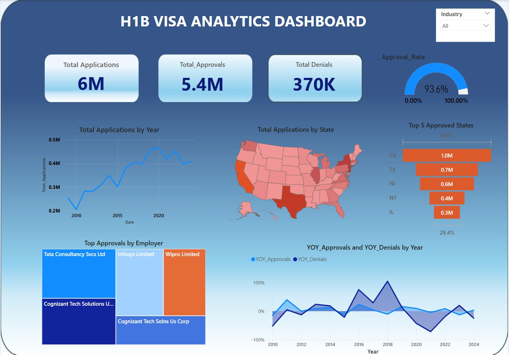

#  H1B Visa Analysis Dashboard | Power BI

This project presents an interactive Power BI dashboard that analyzes H1B visa data from **2014 to 2023**, offering detailed insights across sectors, employers, and application outcomes.

##  Overview
The dashboard provides an in-depth exploration of trends in H1B visa applications over a 10-year period. It focuses on key performance metrics and visual patterns in approvals and denials, helping uncover which sectors and years experienced spikes or declines in visa activity.

##  Key Features

- **Timeframe:** 2014 - 2023
- **Dynamic KPIs:**
  - Total Employees
  - Total Applications
  - Total Denials
- **YOY Trends:**
  - Year-over-Year (YoY) Approvals
  - Year-over-Year (YoY) Denials
- **Category-wise Analysis:**
  - Breakdown by Industry Sector
  - Employer-wise Application Counts

##  Insights Delivered

- Identify the most active sectors in H1B sponsorship.
- Discover trends in application success and denial rates.
- Evaluate employer trends over the decade.

##  Tools & Technologies

- **Power BI** for visualization
- **DAX** for calculations and KPI metrics
- **CSV/Excel** as data source

